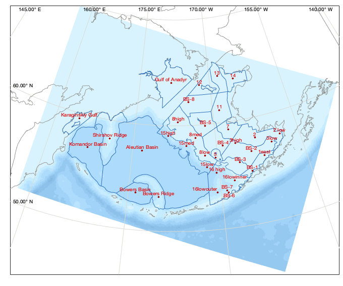
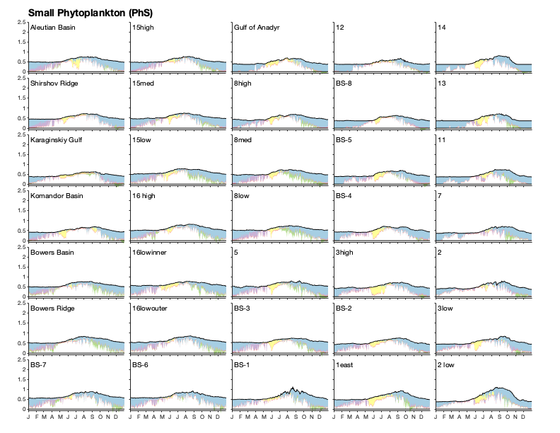
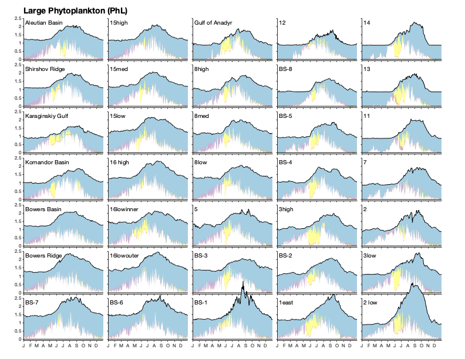
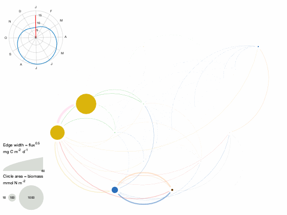
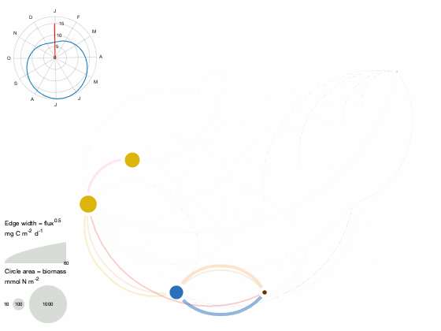
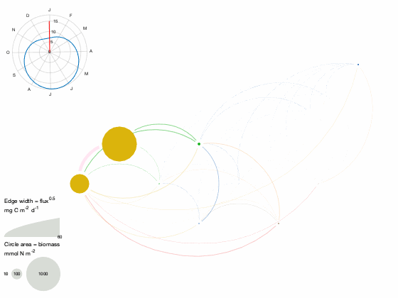

Supplementary material for Kearney et al., 2019: A coupled pelagic-benthic-sympagic biogeochemical model for the Bering Sea: documentation and validation of the BESTNPZ model within a high-resolution regional ocean model.

Full citation:

Kearney, K, Hermann, A, Cheng, W, Ortiz, I, Aydin, K. A coupled pelagic-benthic-sympagic biogeochemical model for the Bering Sea: documentation and validation of the BESTNPZ model within a high-resolution regional ocean model. In prep for Geosci. Model. Dev.

## Contents

            
- Bering10K station locations        
- Factors limiting net accumulation rate of phytoplankton        
- Animations of fluxes between state variables

## Bering10K station locations

The Bering10K ROMS simulations make use several stations, which specify locations within the ROMS domain at which high temporal resolution output is saved.  The locations were chosen based a set of diagnostic region polygons.  On the eastern shelf, these polygons replicate the Bering Sea Project marine regions (Ortiz, I., Wiese, F., Greig, A. 2012. Marine Regions Boundary Data for the Bering Sea Shelf and Slope. Version 1.0. UCAR/NCAR - Earth Observing Laboratory. [DOI:10.5065/D6DF6P6C](https://doi.org/10.5065/D6DF6P6C)).  Additional polygons were added to cover the  basin portion of the domain.  Finally, stations  replicating the location of the [Bering Sea moorings https://www.pmel.noaa.gov/foci/foci_moorings/mooring_info/mooring_location_info.html](EcoFOCI) were added.

## Factors limiting net accumulation rate of phytoplankton

The following set of figures show the factors limiting phytoplankton accumulation rates at each of the station locations in the map above. While the values shown in these figures simplify the dynamics of the full depth-resolved nature of the model, they are helpful in comparing the potential contribution of various processes to overall phytoplankton growth rates.  These plots are modeled after Behrenfeld and Boss, 2018 (Student&#8217;s tutorial on bloom hypotheses in the context of phytoplankton annual cycles. &#65279;Glob Change Biol. 2018;24:55&#8211;77.)

Each plot begins by plotting the maximum potential growth rate (d$^{-1}$), averaged over the euphotic zone.  This is a function of temperature only. Next, that value is adjusted downward based on the amount of light in the euphotic zone (blue), reflecting limitation based on decreased incident sunlight and day length.  The next downward adjustment (yellow) indicates further decreases in growth rate due to macronutrient limitation in the euphotic zone.  Limitation due to deep mixing (purple) is calculated as a ratio of the euphotic depth to the mixed layer depth; this accounts for light limitation due to phytoplankton spending only a fraction of their time in the euphotic zone.  Losses due to phytoplankton respiration and non-predatory mortality are show in red, and due to grazing in green.  A final value greater than zero indicates a net positive accumulation rate, with increasing phytoplankton population.

## Animations of fluxes between state variables

The following animations visualize the flux of material between state variables over a single year.  The plot of daylight hours in the upper left serves as a seasonal "clock" for the animation.

Station BS-2 (south middle shelf)

Station BS-4 (central middle shelf)

Station 14 (Norton Sound)

Station Aleutian Basin

[Published with MATLAB R2018a]("http://www.mathworks.com/products/matlab/")